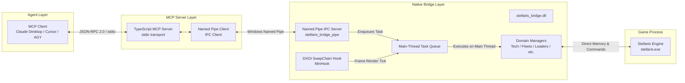

# Stellaris MCP Bridge

[](#)
[](./README.zh-CN.md)
[](./LICENSE)

`stellaris-mcp` is a native game bridge and Model Context Protocol (MCP) server for **Stellaris** (群星). It enables AI agents (Claude Desktop, Cursor, Antigravity, etc.) and reinforcement learning frameworks to perceive, analyze, and play Stellaris with native determinism, zero OCR latency, and full thread safety.

> [!WARNING]
> This is an unofficial research and agentic gaming project. It is not affiliated with or endorsed by Paradox Interactive. The Bridge operates via in-process DLL injection into `stellaris.exe` on Windows. Always back up your save files before use.

---

## Architecture Overview



The system is engineered around three primary design requirements:
1. **Thread Safety & Stability**: Stellaris is not thread-safe for external memory manipulation. The bridge hooks `IDXGISwapChain::Present` via [MinHook](https://github.com/TsudaKageyu/minhook). State queries and command dispatches are enqueued into a thread-safe `TaskQueue` and processed exclusively on the engine's main rendering thread.
2. **Deterministic Native Commands**: Game actions are never simulated through clumsy mouse/keyboard clicks. Instead, they are instantiated as native Clauswitz engine command objects (`CPauseCommand`, `CSelectResearchCommand`, `CHireLeaderCommand`, `CReinforceFleetCommand`, etc.) and dispatched through the engine's internal command processor.
3. **Progressive Disclosure Architecture**: To prevent context window bloat and token exhaustion, game observation is structured into 3 distinct layers:
   - **Layer 1: Global Perception (`stellaris_get_status`)**: Compact, high-density snapshot covering date, simulation speed, pause state, empire capacity, all 26 resource flows, and summary indicators.
   - **Layer 2: Domain Deep-Dive**: Targeted read tools invoked only when relevant (e.g., query tech choices only when research is idle, query species rights only when managing populations).
   - **Layer 3: Native Action Execution**: Fine-grained, validated mutations that affect the simulation state.

---

## Tool Catalog (29 Tools)

### Layer 1: Global Perception

| Tool | Parameters | Description |
|---|---|---|
| `stellaris_get_status` | *(none)* | Global empire overview: date, pause state, speed (0-4), 26 resource stockpiles & net incomes, empire size, fleet/starbase capacities, and subsystem alert counters. |

### Layer 2: Domain Queries

| Tool | Parameters | Description |
|---|---|---|
| `stellaris_get_active_events` | *(none)* | Retrieves all pending event windows, including event IDs, titles, descriptions, and option choices with validity flags. |
| `stellaris_get_notifications` | *(none)* | Retrieves active top-bar message notifications queue (badges awaiting acknowledgment). |
| `stellaris_get_alerts` | *(none)* | Retrieves active top-bar alert banners (`CAlertIconsWindow`), alert IDs (0..65), titles, and tooltips. |
| `stellaris_get_research_state` | *(none)* | Retrieves current research progress, active tech, and available research options across Physics, Society, and Engineering. |
| `stellaris_get_situation_log` | *(none)* | Retrieves active situations (progress, stages, approaches), special projects, and scanned anomalies. |
| `stellaris_get_government` | *(none)* | Retrieves government form, authority, ethics, active civics, council slots/members, and active agenda progress. |
| `stellaris_get_traditions` | *(none)* | Retrieves adopted tradition trees, unlocked perks, available tradition slots, and adoptable trees. |
| `stellaris_get_edicts` | *(none)* | Retrieves active and available edicts, current edict fund, and unity upkeep. |
| `stellaris_get_leaders` | *(none)* | Retrieves hired leaders and current recruitment pool, including classes, levels, traits, and current assignments. |
| `stellaris_get_species` | `mode` (`"empire"` \| `"galaxy"`), `species_id` *(optional)* | Retrieves species portraits, traits, pop counts, and current 9-category rights configurations alongside the available rights catalog. |
| `stellaris_get_fleets` | `fleet_id` *(optional)*, `include_civilian` *(optional)* | Retrieves detailed fleet breakdowns: military power, ship designs, current counts, template target quotas, and reinforcement deficits. |

### Layer 3: Native Action Execution

| Tool | Parameters | Description |
|---|---|---|
| `stellaris_set_paused` | `paused: boolean` | Deterministically pauses or resumes the game simulation via native `CPauseCommand`. |
| `stellaris_set_speed` | `speed: 0..4` | Sets simulation speed (0: Slowest, 1: Slow, 2: Normal, 3: Fast, 4: Very Fast). |
| `stellaris_resolve_event` | `window_id: int`, `option_index: int` | Selects an option choice for a modal event window and dismisses the dialog. |
| `stellaris_open_notification` | `index: int` | Triggers a left-click on a top-bar notification badge to open its associated modal. |
| `stellaris_open_alert` | `alert_id: int` | Triggers a click on a top-bar alert banner to open its corresponding subsystem view. |
| `stellaris_select_research` | `slot: string`, `tech_key: string` | Assigns a technology to research via native `CSelectResearchCommand`. |
| `stellaris_cancel_research` | `slot: string` | Cancels current technology research in the specified physics/society/engineering slot. |
| `stellaris_set_situation_approach` | `situation_id: int`, `approach_index: int` | Modifies the approach/stance for an active situation via `CSetSituationApproachCommand`. |
| `stellaris_launch_council_agenda` | `agenda_key: string` | Launches or activates a council agenda via native agenda commands. |
| `stellaris_adopt_tradition` | `tradition_key: string` | Adopts a new tradition tree or unlocks a tradition perk via `CAdoptTraditionCommand`. |
| `stellaris_toggle_edict` | `edict_key: string`, `enabled: boolean` | Toggles an imperial edict on or off via native `CToggleEdictCommand`. |
| `stellaris_hire_leader` | `candidate_id: int` | Recruits a leader candidate from the active pool via `CHireLeaderCommand`. |
| `stellaris_dismiss_leader` | `leader_id: int` | Dismisses a hired leader from the empire via `CDismissLeaderCommand`. |
| `stellaris_assign_leader` | `leader_id: int`, `slot_type: string`, `target_id: int` | Assigns a leader to a council seat, fleet, planet, or army via `CAssignLeaderCommand`. |
| `stellaris_set_species_rights` | `species_id: int`, `category: string`, `right_value: string` | Configures species rights (citizenship, living standards, military service, slavery, purge, etc.) via `CSetSpeciesRightCommand`. |
| `stellaris_reinforce_fleet` | `fleet_id: int` | Dispatches shipbuilding orders to available shipyards to fulfill fleet template deficits via `CReinforceFleetCommand`. |
| `stellaris_set_fleet_template_quota` | `fleet_id: int`, `design_id: int`, `target_quota: int` | Modifies the target quota for a ship design within a fleet template (`CFleetTemplate::AddDesign`). |

---

## Project Structure

```
stellarismcp/
├── CMakeLists.txt              # Root CMake build configuration
├── stellaris_bridge/           # Native C++ DLL (MinHook + IPC + Game State)
│   ├── CMakeLists.txt
│   ├── include/                # Header definitions & manager interfaces
│   └── src/                    # Hook manager, IPC server, command dispatchers
├── plugin/                     # Launcher plugin manifest, default settings, plugin README
├── stellaris_mcp_server/       # TypeScript MCP Server (Node.js SDK)
│   ├── package.json
│   ├── tsconfig.json
│   └── src/
│       ├── index.ts            # Entrypoint & stdio transport setup
│       ├── pipe_client.ts      # Named Pipe IPC client
│       └── tools.ts            # MCP tool registrations (29 tools)
├── scripts/                    # Automation, injection, and reverse-engineering tools
│   ├── build.ps1               # Automated MSVC Release build script
│   ├── make_plugin.py          # Assembles the launcher plugin folder / release zip
│   ├── reload_dll.py           # Development: re-inject a fresh build into the running game
│   └── ...                     # Memory exploration & verification scripts
└── README.md
```

---

## Prerequisites

- **Operating System**: Windows 10 / 11 (x64)
- **Game**: Stellaris (x64 Windows executable)
- **Compiler**: Visual Studio 2022 (with "Desktop development with C++") & CMake 3.20+
- **Runtime**: Node.js (v18.0.0 or newer)
- **Scripting**: Python 3.10+ (with `ctypes` support)

---

## Getting Started

The bridge is a **Stellaris launcher plugin** (DLL plugin spec v2 of the
[Stellaris launcher](https://github.com/Yidhar/stellaris-Launcher), `stl`). The launcher installs it, checks it against
the installed game build, and loads it into the game. Nothing goes into the game folder, and starting the game from Steam
or the Paradox Launcher starts it without the bridge.

### 1. Install a release

1. Download `stellaris-mcp-<version>.zip` from the releases. Its files are the plugin folder itself.
2. Install it with the launcher's Plugins page (*Install plugin*), or unpack it into
   `Documents\Paradox Interactive\Stellaris\plugins\stellaris-mcp\`.
3. Enable it in your playset (`stl plugin enable stellaris-mcp`) and start the game with `stl launch` or the Play button.
4. Install the MCP server's dependencies once: run `mcp-server\install.cmd` in the plugin folder (Node.js 20+; it runs
   `npm ci --omit=dev` from the lockfile). They are not shipped; run it again after updating the plugin.
5. Register the MCP server in the plugin folder (`mcp-server\dist\index.js`) with your client, see below.

The plugin folder:
```
plugins\stellaris-mcp\
  stl-plugin.json            manifest (game build it is made for, settings files)
  stellaris_bridge.dll
  defaults\stellaris_mcp.ini default settings
  config\stellaris_mcp.ini   your settings (made from defaults\ by the launcher)
  logs\stellaris_mcp.log     the bridge's log
  mcp-server\                the MCP server (Node.js 20+); install.cmd installs its dependencies
```

### 2. Settings and log

`config\stellaris_mcp.ini` holds `[log] enabled` (`true` / `false`) and `level` (`info`: start-up, errors, timeouts;
`debug`: also every pipe request with its duration). Edit it from the launcher's Plugins page (gear button); the bridge
re-reads it within a couple of seconds while the game runs. Without the file it uses those defaults.

### 3. Build from source

```powershell
.\scripts\build.ps1                                   # -> build/stellaris_bridge/Release/stellaris_bridge.dll
cd stellaris_mcp_server; npm install; npm run build; cd ..
python scripts/make_plugin.py --with-deps             # -> build/plugin/stellaris-mcp (--zip <file> for a zip)
D:\stellaris-Launcher\target\release\stl.exe plugin install build/plugin/stellaris-mcp
```

During development the scripts in `scripts/` (`reload_dll.py`, `build_and_reload.py`) inject the freshly built DLL by
hand; it then keeps its `config\` and `logs\` next to the build output.

---

## Client Configuration

### Claude Desktop

Add the following to your `claude_desktop_config.json` (located at `%APPDATA%\Claude\claude_desktop_config.json`):

```json
{
  "mcpServers": {
    "stellaris": {
      "command": "node",
      "args": [
        "C:\\Users\\<you>\\Documents\\Paradox Interactive\\Stellaris\\plugins\\stellaris-mcp\\mcp-server\\dist\\index.js"
      ]
    }
  }
}
```

### Cursor / Antigravity

In your MCP configuration:
```json
{
  "name": "stellaris",
  "command": "node",
  "args": ["C:/Users/<you>/Documents/Paradox Interactive/Stellaris/plugins/stellaris-mcp/mcp-server/dist/index.js"]
}
```

---

## Development & Reverse Engineering

The `scripts/` directory contains numerous standalone scripts developed during offset discovery and RTTI analysis:
- `scripts/full_pipeline_verification.py`: End-to-end verification script testing the Named Pipe connection, status retrieval, event parsing, and command dispatch.
- `scripts/dump_catalog.py`: Dumps available trait, tech, and building catalogs from game memory.
- `scripts/inspect_leaders.py` / `inspect_fleets.py`: Inspects live game object pointer hierarchies.

---

## License

This project is licensed under the [MIT License](LICENSE).
