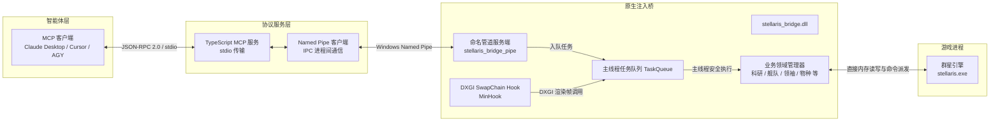

# Stellaris MCP Bridge

[](#)
[](./README.md)
[](./LICENSE)

`stellaris-mcp` 是专为 Paradox Interactive 的大战略游戏 **《群星》（Stellaris）** 打造的原生底层注入桥接与模型上下文协议（Model Context Protocol, MCP）服务。它支持大语言模型与自主智能体（Claude Desktop、Cursor、Antigravity 等）通过原生确定性内存接口对《群星》进行实时状态感知、全局决策与游戏控制，杜绝传统 OCR 方案的高延迟与幻觉。

> [!WARNING]
> 本项目为非官方开源研究项目，与 Paradox Interactive 无任何隶属或背书关系。Bridge 通过在 Windows 上向 `stellaris.exe` 进程注入 DLL 进行工作。使用前请务必备份游戏存档。

---

## 核心架构



系统围绕三大第一性原理工程规范进行设计：
1. **主线程安全与零崩溃**：《群星》引擎并非线程安全。Bridge 通过 [MinHook](https://github.com/TsudaKageyu/minhook) 挂载 `IDXGISwapChain::Present` 渲染钩子。所有跨进程 IPC 请求全部提交至线程安全 `TaskQueue`，严格在引擎主渲染循环的上下文内执行，彻底杜绝多线程竞争导致的内存崩溃。
2. **确定性原生引擎指令（Zero-Hallucination Actions）**：拒绝模拟键鼠点击。所有修改游戏状态的动作直接实例化引擎内部原生指令对象（如 `CPauseCommand`、`CSelectResearchCommand`、`CHireLeaderCommand`、`CReinforceFleetCommand`、`CSetSpeciesRightCommand` 等），通过游戏引擎命令总线派发执行。
3. **渐进式披露架构（Progressive Disclosure）**：为避免大模型上下文窗口膨胀和 Token 浪费，设计三层感知与控制：
   - **第一层：全局宏观感知（Global Perception - `stellaris_get_status`）**：低 Token 开销的高信息密度快照，包括游戏日期、流速、暂停状态、帝国规模、舰队/星区容量、全部 26 种资源收支指标以及各子系统概要。
   - **第二层：领域按需下钻（Domain Deep-Dive）**：仅在需要时调用的专项查询工具（如在科研空闲时查科技库，在领袖空缺时查候选池，在物种政策调整时查权力矩阵）。
   - **第三层：原子操作执行（Native Action Execution）**：精准执行引擎状态突变指令。

---

## 工具目录（共 29 个工具）

### 第一层：全局宏观感知

| 工具名 | 参数 | 功能说明 |
|---|---|---|
| `stellaris_get_status` | *(无)* | 获取帝国全局状态快照：游戏日期、暂停状态、模拟速度（0-4）、26 种资源储量与净收支、帝国规模、舰队与恒星基地容量、以及情势/议程/传统/领袖等红点指示器。 |

### 第二层：领域按需查询

| 工具名 | 参数 | 功能说明 |
|---|---|---|
| `stellaris_get_active_events` | *(无)* | 查询当前弹出的所有待处理事件窗口、事件文本、标题及各分支选项的有效性状态。 |
| `stellaris_get_notifications` | *(无)* | 查询顶部通知队列（待点击处理的消息徽标）。 |
| `stellaris_get_alerts` | *(无)* | 查询顶部预警横幅（`CAlertIconsWindow`，Alert ID 0..65）、预警标题与悬浮提示。 |
| `stellaris_get_research_state` | *(无)* | 查询物理学、社会学、工程学三大科研槽位的在研科技、研发进度及当前可抽选的研究选项。 |
| `stellaris_get_situation_log` | *(无)* | 查询情势记录（Situation Log）：正在发生的情势阶段与对策、特殊项目以及已扫描的异常点。 |
| `stellaris_get_government` | *(无)* | 查询政体形式、权威、思潮、国策、内阁席位人选及当前议程准备进度。 |
| `stellaris_get_traditions` | *(无)* | 查询已开传统树、已解锁传统专精、可用槽位及当前可选传统。 |
| `stellaris_get_edicts` | *(无)* | 查询所有可用法令、激活状态、法令基金额度及凝聚力维护费。 |
| `stellaris_get_leaders` | *(无)* | 查询在职领袖与待招募候选池（领袖类别、等级、正负面特质、任命位置等）。 |
| `stellaris_get_species` | `mode`（`"empire"` \| `"galaxy"`），`species_id` *(可选)* | 查询帝国或全银河物种肖像、特质、人口数量及 9 大权力类别配置矩阵（公民权、生活标准、净化等）。 |
| `stellaris_get_fleets` | `fleet_id` *(可选)*，`include_civilian` *(可选)* | 查询舰队详情：战斗力预估、舰船设计明细、现有编制、模版配额及增援缺额状态。 |

### 第三层：原生操作执行

| 工具名 | 参数 | 功能说明 |
|---|---|---|
| `stellaris_set_paused` | `paused: boolean` | 通过引擎原生 `CPauseCommand` 确定性暂停或恢复游戏模拟。 |
| `stellaris_set_speed` | `speed: 0..4` | 设置游戏流速（0: 最慢, 1: 慢, 2: 正常, 3: 快, 4: 极快）。 |
| `stellaris_resolve_event` | `window_id: int`, `option_index: int` | 依据窗口 ID 与选项下标选择事件分支并自动关闭事件弹窗。 |
| `stellaris_open_notification` | `index: int` | 点击顶部通知队列中的消息徽标，将其展开为交互事件或异常视图。 |
| `stellaris_open_alert` | `alert_id: int` | 点击顶部预警图标打开对应界面视图。 |
| `stellaris_select_research` | `slot: string`, `tech_key: string` | 通过原生 `CSelectResearchCommand` 为指定科研槽位指派研发科技。 |
| `stellaris_cancel_research` | `slot: string` | 取消指定槽位当前正在研发的科技。 |
| `stellaris_set_situation_approach` | `situation_id: int`, `approach_index: int` | 通过 `CSetSituationApproachCommand` 调整进行中情势的应对策略分支。 |
| `stellaris_launch_council_agenda` | `agenda_key: string` | 启动或激活指定的内阁议程。 |
| `stellaris_adopt_tradition` | `tradition_key: string` | 通过 `CAdoptTraditionCommand` 采纳新传统树或点出传统分支。 |
| `stellaris_toggle_edict` | `edict_key: string`, `enabled: boolean` | 通过 `CToggleEdictCommand` 开启或关闭帝国法令。 |
| `stellaris_hire_leader` | `candidate_id: int` | 通过 `CHireLeaderCommand` 从招募池雇佣指定领袖。 |
| `stellaris_dismiss_leader` | `leader_id: int` | 通过 `CDismissLeaderCommand` 解雇指定领袖。 |
| `stellaris_assign_leader` | `leader_id: int`, `slot_type: string`, `target_id: int` | 通过 `CAssignLeaderCommand` 任命领袖到内阁席位、舰队、科研船、行星或军团。 |
| `stellaris_set_species_rights` | `species_id: int`, `category: string`, `right_value: string` | 通过 `CSetSpeciesRightCommand` 修改物种权力（公民权、生活水平、军事服役、迁徙等）。 |
| `stellaris_reinforce_fleet` | `fleet_id: int` | 通过 `CReinforceFleetCommand` 向可用造船厂一键下达补满模版缺额的增援订单。 |
| `stellaris_set_fleet_template_quota` | `fleet_id: int`, `design_id: int`, `target_quota: int` | 原生修改舰队模版（`CFleetTemplate`）内指定舰船型号的目标配额。 |

---

## 仓库结构

```
stellarismcp/
├── CMakeLists.txt              # 根 CMake 构建配置
├── stellaris_bridge/           # 原生 C++ 动态链接库（MinHook + 命名管道 + 内存业务）
│   ├── CMakeLists.txt
│   ├── include/                # 头文件定义与管理器接口
│   └── src/                    # 钩子挂载、IPC 服务端、命令派发器
├── stellaris_mcp_server/       # TypeScript MCP 服务端（Node.js SDK）
│   ├── package.json
│   ├── tsconfig.json
│   └── src/
│       ├── index.ts            # 服务入口与 stdio 传输
│       ├── pipe_client.ts      # Windows 命名管道客户端
│       └── tools.ts            # 29 个 MCP 工具的具体注册与类型校验
├── scripts/                    # 编译、注入与逆向工程辅助脚本
│   ├── build.ps1               # MSVC Release 自动化构建脚本
│   ├── auto_inject.py          # 自动检测 stellaris.exe 并完成安全注入
│   ├── inject.py               # Win32 原生内存注入工具
│   └── ...                     # 内存探测与全链路验证脚本
└── README.md
```

---

## 环境要求

- **操作系统**：Windows 10 / 11 (x64)
- **游戏客户端**：正版《群星》（Stellaris x64 Windows 客户端）
- **编译工具链**：Visual Studio 2022（需安装“使用 C++ 的桌面开发”工作负载）及 CMake 3.20+
- **运行环境**：Node.js (v18.0.0 或更高版本)
- **脚本环境**：Python 3.10+ (需支持 `ctypes`)

---

## 快速上手

### 1. 编译原生注入 DLL

在 PowerShell 中直接运行：
```powershell
.\scripts\build.ps1
```
*或使用标准 CMake 编译：*
```bash
mkdir build && cd build
cmake .. -A x64
cmake --build . --config Release
```
构建成功后将在 `build/stellaris_bridge/Release/stellaris_bridge.dll` 生成二进制文件。

### 2. 构建 MCP 服务端

```bash
cd stellaris_mcp_server
npm install
npm run build
```

### 3. 启动游戏并注入 Bridge

1. 启动 **《群星》** 并载入现有存档或开启新对局。
2. 打开终端，运行自动注入脚本：
```bash
python scripts/auto_inject.py
```
终端将输出自动捕获到 `stellaris.exe` 进程及成功注入的提示：
```
[*] Waiting for stellaris.exe process to appear...
[+] Found stellaris.exe with PID: 12345
[+] Found active Stellaris window. Waiting 8s for graphics pipeline...
[+] Injected DLL into target process.
[+] Injection complete!
```

---

## 客户端配置接入

### Claude Desktop

在 Claude Desktop 配置文件（路径通常为 `%APPDATA%\Claude\claude_desktop_config.json`）中添加：

```json
{
  "mcpServers": {
    "stellaris": {
      "command": "node",
      "args": [
        "D:\\stellarismcp\\stellaris_mcp_server\\dist\\index.js"
      ]
    }
  }
}
```

### Cursor / Antigravity

在 MCP 配置中添加：
```json
{
  "name": "stellaris",
  "command": "node",
  "args": ["D:/stellarismcp/stellaris_mcp_server/dist/index.js"]
}
```

---

## 许可证

本项目基于 [MIT License](LICENSE) 开源。
