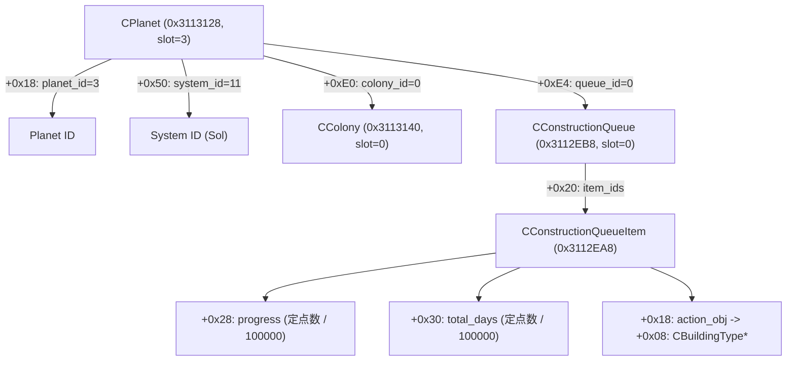

# Stellaris 4.5 逆向关键内存映射与数据链路速查 (Reverse Engineering Cheatsheet)

本手册总结了《群星》（Stellaris 4.5）基于反编译源码（`stellaris_4.5_source.cpp`）与实机动态二进制比对验证的核心全局数据库、实体挂载载体（Carrier）链条、指令栈帧结构与状态解析逻辑。

---

## 1. 核心全局数据库基址 (Global Databases: base + offset)
模块基址 `base = (uintptr_t)GetModuleHandleA("stellaris.exe")`

Paradox Clausewitz 引擎的所有全局实体均继承自 `TPdxRefDatabase<T, 8u>`：
- `+0x18`: 对象指针数组 (`T** arr`)，每个槽位 16 字节，`arr + (id & 0xFFFFFF) * 16 + 8` 为真实实体指针；
- `+0x20`: 槽位容量 (`uint32_t capacity`)。

| 数据库 | 基址偏移 | 容量 | 说明 |
| :--- | :--- | :--- | :--- |
| `TPdxRef<CSolarSystem>::_pDatabase` | `base + 0x3113148` | 1024 | **星系数据库**。Slot 11 为太阳系（Sol），Slot 63 为科尔星系（Khor）。`+0x450` 为星系名。 |
| `TPdxRef<CPlanet>::_pDatabase` | `base + 0x3113128` | 2048 | **行星数据库**。Slot 0 为恒星太阳；Slot 3 为**地球**；Slot 752 为**科尔-I**。 |
| `TPdxRef<CColony>::_pDatabase` | `base + 0x3113140` | 1024 | **殖民地数据库**。Slot 0 为地球殖民地，其 `+0xf78` 回指 Planet 3。 |
| `TPdxRef<CConstructionQueue>::_pDatabase` | `base + 0x3112EB8` | 4096 | **建造队列数据库**。Queue 0 为地球地表队列；Queue 2 为太阳恒星基地队列；Queue 2015 为科尔-I 地表队列。 |
| `TPdxRef<CConstructionQueueItem>::_pDatabase` | `base + 0x3112EA8` | 16384+ | **建造项目数据库**。存储正在建造中的具体建筑、区划、特化项。 |
| `TPdxRef<CCountry>::_pDatabase` | `base + 0x3112F50` | 256 | **国家数据库**。Slot 0 为玩家帝国。 |

---

## 2. 行星 -> 殖民地 -> 地表建造队列 直读链路 (Planet Direct Access)

### 实体核心成员偏移：
1. **行星对象 (`CPlanet*`, 位于 `0x3113128`)**：
   - `+0x18`: `planet_id` (`uint32_t`)
   - `+0x50`: 所属星系 `system_id` (`uint32_t`)
   - `+0xe0`: 殖民地 ID `colony_id` (`uint32_t`，未殖民为 `0xFFFFFFFF`)
   - `+0xe4`: 地表建造队列 ID `queue_id` (`uint32_t`，未殖民/无队列为 `0xFFFFFFFF`)
   - `+0x108`: 行星名称 PdxString (`NAME_Earth`)
2. **殖民地对象 (`CColony*`, 位于 `0x3113140`)**：
   - `+0x10`: `colony_id`
   - `+0xf70`: `std::variant<TPdxRef<CPlanet>, TPdxRef<CShip>>` 载体类型枚举
   - `+0xf78`: 挂载载体 ID（即回指的 `planet_id`，地球为 3）
   - `+0xfc8`: `pop_capacity`
   - `+0xfe8`: `pop_groups`
3. **建造队列对象 (`CConstructionQueue*`, 位于 `0x3112EB8`)**：
   - `+0x08`: 队列 ID (`queue_id`)
   - `+0x20`: 建造项 ID 数组指针 (`uint32_t*`)
   - `+0x2c`: 当前项目数 (`uint32_t count`)
   - `+0x30`: 拥有者国家 ID (`uint32_t owner_country_id`)
   - `+0x44`: 挂载载体 ID (`carrier_id`，地球地表队列为 3，太阳星基地队列为 0)
   - `+0x4c`: 队列类型 (`1` = 行星地表队列, `2` = 恒星基地队列)
4. **建造项目对象 (`CConstructionQueueItem*`, 位于 `0x3112EA8`)**：
   - `+0x18`: `action_obj` 指针（即 `CBuildableBuilding`）
   - `+0x28`: 建造进度定点数 (`prog`)，天数 = `prog / 100000`
   - `+0x30`: 建造总天数定点数 (`tot`)，天数 = `tot / 100000`
   - `action_obj + 0x08`: `CBuildingType*` 建筑类型定义指针
   - `bldg_def + 0x20`: 建筑 Key PdxString（如 `building_energy_grid`）

---

## 3. CAddBuildableToQueueCommand 指令栈帧结构

在派发建筑建造指令时，在栈上分配并初始化下列数据结构：

### 1. `CBuildableBuilding` (0x20 bytes)
- `+0x00`: 虚表指针 (`base + 0x2391298`)
- `+0x08`: `CBuildingType*`（通过 `FindDbElementByKey(0x3110C00, key)` 获取）
- `+0x10`: `colony_id` (`uint32_t`，地球为 0)
- `+0x14`: `target_zone_id` (`uint32_t`，如发电区划特化槽为 63)

### 2. `CAddBuildableToQueueCommand` (0x30 bytes)
- `+0x00`: 指令虚表指针 (`base + 0x23C09F8`)
- `+0x08`: `0xFFFFFFFF`
- `+0x10`: `0xFFFF0000`
- `+0x14`: `0`
- `+0x18`: `0`
- `+0x20`: 指向已构造的 `CBuildableBuilding` 结构指针
- `+0x28`: 国家 ID (`country_id` = 0)
- `+0x2C`: 队列 ID (`queue_id` = 0)

### 3. 指令验证与入队函数
- 验证函数：`vt[8]` 即 `CAddBuildableToQueueCommand::IsValid(CResourceTable&, CString*)`。
  - 核心检查：`queue_obj->owner == cmd->country_id`，且 `CanAddItem` 返回 true。
- 入队函数：`base + 0xB7DB80`（`FnEnqueueCmd`），将指令安全提交到游戏命令调度队列中。

---

## 4. 关键逆向避坑铁律 (Critical Gotchas)

1. **规避“零值陷阱” (The Zero-Value Trap)**：
   - 引擎中 `0` 是合法有效 ID（例如地球的建造队列就是 `Queue 0`，地球殖民地是 `Colony 0`，玩家国家是 `Country 0`）。
   - 引擎内部的无效/空句柄统一表示为 `0xFFFFFFFF` (`UINT32_MAX`)。
   - **绝对禁止**在读取或校验队列 ID 时使用 `if (queue_id == 0) return;`！必须使用 `if (queue_id == 0xFFFFFFFF)`。
2. **严禁混淆星系库与行星库**：
   - `0x3113148` 是 `CSolarSystem`，其 slot 11 是太阳系（Sol）；
   - `0x3113128` 是 `CPlanet`，其 slot 3 是地球（Earth）；
   - 若将 11 当作行星查，会查到未殖民的木卫一（Io）或太阳星系母体，最终误将地表建筑派发给太阳恒星基地的船坞队列（Queue 2），导致游戏 UI 地表队列永久为空。
3. **不可跨线程远程执行 UI 函数**：
   - 游戏内部 UI 函数强依赖主线程消息泵与 UI 上下文锁，跨线程注入调用会导致线程死锁或崩溃。
   - 数据查询坚守纯数据结构安全解引用直读；指令下发通过 `TaskQueue` 在 DX11 渲染钩子主线程安全分发。
4. **定点数归一化**：
   - 引擎内部时间与进度采用 `1/100000` 定点数存储（例如 360 天为 `36000000`）。
   - 暴露给 MCP 或外部 API 时必须做 `/ 100000` 换算。

## 5. 局势日志：局势 / 特殊项目 / 异常点 (Situation Log, verified 4.5.1)

- 局势库是 `sdk::db::CSituation`（`CGameStateDatabase` 构造顺序对齐得出）。旧地址 `+0x3114060` 是 `TPdxRef<CDeadCountry>`，`+0x31140A0` 是 `TPdxRef<CDeadWar>`，都不是局势数据。
- `CSituation::progress` / `last_month_progress` 为 int64 定点数，**缩放 100000**：`end = 1920` 的阶段在 `+0x588` 缓存为 `{0, 192000000}`。
- 特殊项目与异常点在国家的 `CCountry::events`（`CCountryEventManager`）里：
  - `special_project`：`{data, ..., size @ +0xC}`，元素是 `CSpecialProjectInstance*`；类型指针 `special_project`(+0x28) 的 key 在类型 `+0x18`。物种修饰/提升项目持有空类型，名字按 `CSpecialProjectInstance::GetName` 用 `MOD_TRAIT_PROJECT`(TEMPLATE) / `UPLIFT_PROJECT`(SPECIES) 拼，判定调用 `sdk::fn::CSpecialProjectInstance_IsSpeciesModification` / `IsUplift`；残骸项目用 `SPECIAL_PROJECT_DEBRIS`(SYSTEM)。
  - `anomalies`：`ref_array<TPdxRef<CPlanet>>` 对象 `{vtable, data @ +8, size @ +0x14}`；星球的 `CPlanet::anomaly`(+0x4B0) 在研究前指向异常类别（key 在 `+0x20`），研究后是空对象。

## 6. 星系地图 (Galaxy Map, verified 4.5.1)

- 星系库 `sdk::db::CGalacticObject`：id 在 `+8`；`coordinate`(CCelestialCoordinate) 的 `x`/`y` 为定点数 ×100000（本存档范围约 ±300）；`origin` 为 `0xFFFFFFFF`（星系本身）。
- `hyperlane`(+0x590) 是**无 vtable** 的 `{data, size @ +8}` 数组，元素 `CHyperlane` 0x20 字节：`to` +8、`length` +0x10（×100000）。
- 其他 ref_array（`starbases`、`fleet_presence`）是 `{vtable, data @ +8, cap @ +0x10, size @ +0x14}`。
- 星系所有者是运行时缓存 `sdk::rt::CGalacticObject_owner`（+0x1370），由 anchors.py 从 `HasAutoSurveyedSystem` 读出。
- 行星归属星系：`CPlanet::coordinate.origin`；行星的 `CDepositHolder` 基址在 `planet + 0x20`（id 在 `+0x18`，holder 类型 `+0xB4` = 0）。
- 情报等级调用 `sdk::fn::CCountry_GetIntelLevel(country, system)`（0..4）；普通游戏里 `discovery` 列表不参与判断，所有星系与航道都可见。
- 调查：`CCountry_HasAutoSurveyedSystem || CCountry_HasSurveyedDepositHolder(planet + 0x20)`；他国境内的行星需要通行权才能调查（命令会给出原因）。
- `CColony::carrier` 值为 `{planet id, 类型 0}`；`CCountry::capital` 是首都**殖民地** id。
- 移动：`fleet_send_to_location` 的 `coordinate` 填 `origin = 星系`、`x = y = 0`（`CMoveToSystemPointFleetOrder` 飞到星系中心）。调查：`survey_planet_order` 的 `deposit_holder` 是 `CMetaRef {vtable, type @ +8, id @ +0xC}`（行星 type 0，无 3）；`galactic_object = -1` 调查单颗行星，否则调查整个星系。

## 7. 殖民地、星域与区划特化 (verified 4.5.1)

- 殖民中：`CColony::colonizing_species` 指向真实物种即 `CColony::IsUnderColonization`；进度调用 `sdk::fn::CColony_CalcColonizationProgressPerc(colony, &out)`，`out` 为 0..1 定点数（×100000，界面 ×100 显示）。
- 星域：名称 `CSector::name`（CPersistentName），类型 `CSector::type`（key +0x20，`core_sector` 即核心星域），首府 `CSector::local_capital`（殖民地 id）。不属于任何星域的殖民地，游戏用 `NO_SECTOR`（「无星域」）。
- 区划：`CDistrict {id +8, CColony* +0x18, CDistrictType* +0x20, zones: CPdxArray<CZone id> data +0x30, size +0x3C}`；每个元素是一个特化槽（空槽为 0xFFFFFFFF）。`CBuildableZone {vtable sdk::vt::CBuildableZone, CZoneType* +8, colony +0x10, district +0x14, slot +0x18}`，走建造队列（和建筑相同），`CanBuild` 要求 `slot < size`——不存在"未解锁的第二槽"。
- 前哨：`build_orbital_station_order` 填 `galactic_object = 星系`、`class_ = 10`（Starbase），deposit holder 保持工厂默认（类型 3）。系统必须先被完全调查。

## 8. 宜居度、恒星基地等级 (verified 4.5.1)

- 宜居度：`sdk::fn::NHabitability_CalcHabitability(out, species, carrier = planet + 0x20, country, planet_class = CPlanet::planet_class, pop_group = null, modifier = null)`，`out` 为 0..1 定点数（×100000）。扩张规划器（`ValidatePlanetFilters`）按这个值、玩家的修正、情报等级 > 1、已调查、无主来筛选。
- 恒星基地等级是脚本数据（没有序列化字段）：`CStarbaseLevelType` 的 `ship_size` 在 Windows 为 `+0xF8`（`next_level` +0x100，`previous_level` +0x108）。桥接在运行时取"每个等级都指向舰船尺寸库条目的那个字段"，显示名 = 舰船尺寸 key 的本地化（`starbase_outpost` → 「哨站」）。
- 宜居之外，能否殖民由 `sdk::fn::CPlanet_CanColonize(planet, country, CString* reason)` 判定（`CFleetColonizePlanetCommand::IsValid` 传空 reason 调它，再 `CanQueue`）；原因是 `COLONIZABLE_INSIDE_BORDERS`（只能殖民我方边界内的行星）、`COLONIZABLE_UNSURVEYED`、`COLONIZABLE_HOSTILE_FLEETS` 等。扩张规划器隐藏有通讯的他国星系；他国星系本就不能殖民。

## 9. 舰队航线与 ETA (verified 4.5.1)

`DrawMovementDebugLines`（字符串 `"ETA %.1f days"`，Windows 0x9209A0）内联了 `CFleetMovementManager::CalcPath`，全部地址都从它读出：

- `CFleetPath`（栈上 0x40 足够）：`{vt sdk::vt::CFleetPath, CPdxArray<SNode> {vt sdk::vt::CPdxArray_CFleetPath_SNode, nodes +0x10, capacity +0x18, count +0x1C}, CGameDate +0x20}`；节点 0x30 字节 = `CCelestialCoordinate`（0x28：vt `sdk::vt::CCelestialCoordinate`、x +8、y +0x10、origin 星系 +0x20、randomized +0x25）+ `EPathJumpMethod` +0x28（0 = `jump_hyperlane`，1 = `jump_bypass`）+ bypass id +0x2C（入口节点是到达的那座 bypass：中继器 `relay_bypass`、L-星门 `lgate`、星门、虫洞）。
- 每个星系两个节点（离开点 / 进入点），最后一个是目的地中心。星系中心坐标 = `CCelestialCoordinate(system, 0, 0)`：vt + 全零 + origin。
- 构建：`settings = sdk::fn::CFleet_PathFindSettingsFlag(fleet) ? 3 : 2`（`CFleet::CalcMovementPathFindSettings`），`sdk::fn::CFleetPath_Create(path, from, to, avoid = *TPdxNullObject<CGalacticObject>, fleet, settings)`。起点取舰队自己的位置：`fleet + sdk::rt::CFleet_coordinate_base` 处的次基类 vtable 第 `sdk::vt::CFleet_GetCoordinate` 槽。
- 天数：`sdk::fn::CFleetPath_CalcEstimatedDays(path, &out, fleet, per_node[count])`，定点数 ×100000。`per_node[i]` 是进入第 i 段之前的累计时间，所以到达节点 i = `per_node[i + 1]`（最后一个节点用总数）。**第一段总是从舰队实际位置算起**，因此起点只能是舰队所在处。
- 释放：节点数组用 `sdk::fn::CRT_operator_delete` 释放（引擎的析构也只做这一步）。
- 已与引擎核对：下达移动后舰队自带的路径在 `fleet + 0x600`（`CFleetMovementManager::path`），其 `CGameDate`（小时）减当前日期即 ETA；三支不同舰队的航线逐节点一致，天数差 < 0.5 天（引擎存整小时）。

## 10. 大地图舰队指令与宣称 (verified 4.5.1)

- 取消全部指令 `fleet_cancel_orders`：`country` + `fleets`（`CPdxArray<TPdxRef<CFleet>>` @ +0x28：data +8、capacity +0x10、size +0x14，数据用引擎堆分配，命令自己释放）。`IsValid` 只要有一支舰队归该国控制且有指令即通过（无原因文本）。
- 跟随 `follow_command`：`{fleet, target_fleet, attack, cancelled, queue, queue_to_front}`；`IsValid` 用它将加入的 `CFollowFleetOrder` 自检。
- 姿态 `switch_fleet_stance_command`：`EFleetStance` 0 = passive、1 = aggressive、2 = evasive（名称 `FLEET_STANCE_*`）；当前值 `CFleet::fleet_stance`（+0x460，`CalcMovementPathFindSettings` 里 `cmp [fleet+0x460], 2` 印证）。`IsValid` 只检查舰队支持姿态；跟随别的舰队（舰队编组）时改动不生效。
- MIA `mia_command`：`fleets` @ +0x20，`EMiaType` @ `sdk::rt::CGoMIACommand_mia_type`（+0x38；`IsValid` 首句 `cmp [rcx+0x38], 9`，9 = 无）；0 = `mia_emergency_ftl`，1 = `mia_return_home`。
- 宣称：`add_system_claim_command {country, system, claims, date = 今日（g_CurrentGameState + rt::CGameState_date_hours）}`，`IsValid` = `CGalacticObject::IsClaimableBy` + 影响力费用，带原因；`remove_system_claim_command {country, system, claims}`（≤ 已有宣称，与所有者交战时不可）。已有宣称数用 `sdk::fn::CGalacticObject_GetClaimsBy(system, CClaim* out, country)`，`out + CClaim::claims`（星系上的数组在 +0x558/+0x564，元素 0x18；SDK 里同偏移的 `star_class` 是误标）。

