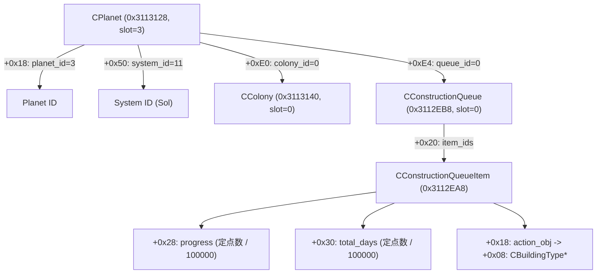

# Stellaris 4.5 逆向关键内存映射与数据链路速查 (Reverse Engineering Cheatsheet)

本手册总结了《群星》（Stellaris 4.5）基于反编译源码（`stellaris_4.5_source.cpp`）与实机动态二进制比对验证的核心全局数据库、实体挂载载体（Carrier）链条、指令栈帧结构与状态解析逻辑。

---

## 1. 核心全局数据库基址 (Global Databases: base + offset)
模块基址 `base = (uintptr_t)GetModuleHandleA("stellaris.exe")`

Paradox Clausewitz 引擎的所有全局实体均继承自 `TPdxRefDatabase<T, 8u>`：
- `+0x18`: 对象指针数组 (`T** arr`)，每个槽位 16 字节，`arr + (id & 0xFFFFFF) * 16 + 8` 为真实实体指针；
- `+0x20`: 槽位容量 (`uint32_t capacity`)。

| 数据库 | 基址偏移 | 容量 | 说明 |
| :--- | :--- | :--- | :--- |
| `TPdxRef<CSolarSystem>::_pDatabase` | `base + 0x3113148` | 1024 | **星系数据库**。Slot 11 为太阳系（Sol），Slot 63 为科尔星系（Khor）。`+0x450` 为星系名。 |
| `TPdxRef<CPlanet>::_pDatabase` | `base + 0x3113128` | 2048 | **行星数据库**。Slot 0 为恒星太阳；Slot 3 为**地球**；Slot 752 为**科尔-I**。 |
| `TPdxRef<CColony>::_pDatabase` | `base + 0x3113140` | 1024 | **殖民地数据库**。Slot 0 为地球殖民地，其 `+0xf78` 回指 Planet 3。 |
| `TPdxRef<CConstructionQueue>::_pDatabase` | `base + 0x3112EB8` | 4096 | **建造队列数据库**。Queue 0 为地球地表队列；Queue 2 为太阳恒星基地队列；Queue 2015 为科尔-I 地表队列。 |
| `TPdxRef<CConstructionQueueItem>::_pDatabase` | `base + 0x3112EA8` | 16384+ | **建造项目数据库**。存储正在建造中的具体建筑、区划、特化项。 |
| `TPdxRef<CCountry>::_pDatabase` | `base + 0x3112F50` | 256 | **国家数据库**。Slot 0 为玩家帝国。 |

---

## 2. 行星 -> 殖民地 -> 地表建造队列 直读链路 (Planet Direct Access)

### 实体核心成员偏移：
1. **行星对象 (`CPlanet*`, 位于 `0x3113128`)**：
   - `+0x18`: `planet_id` (`uint32_t`)
   - `+0x50`: 所属星系 `system_id` (`uint32_t`)
   - `+0xe0`: 殖民地 ID `colony_id` (`uint32_t`，未殖民为 `0xFFFFFFFF`)
   - `+0xe4`: 地表建造队列 ID `queue_id` (`uint32_t`，未殖民/无队列为 `0xFFFFFFFF`)
   - `+0x108`: 行星名称 PdxString (`NAME_Earth`)
2. **殖民地对象 (`CColony*`, 位于 `0x3113140`)**：
   - `+0x10`: `colony_id`
   - `+0xf70`: `std::variant<TPdxRef<CPlanet>, TPdxRef<CShip>>` 载体类型枚举
   - `+0xf78`: 挂载载体 ID（即回指的 `planet_id`，地球为 3）
   - `+0xfc8`: `pop_capacity`
   - `+0xfe8`: `pop_groups`
3. **建造队列对象 (`CConstructionQueue*`, 位于 `0x3112EB8`)**：
   - `+0x08`: 队列 ID (`queue_id`)
   - `+0x20`: 建造项 ID 数组指针 (`uint32_t*`)
   - `+0x2c`: 当前项目数 (`uint32_t count`)
   - `+0x30`: 拥有者国家 ID (`uint32_t owner_country_id`)
   - `+0x44`: 挂载载体 ID (`carrier_id`，地球地表队列为 3，太阳星基地队列为 0)
   - `+0x4c`: 队列类型 (`1` = 行星地表队列, `2` = 恒星基地队列)
4. **建造项目对象 (`CConstructionQueueItem*`, 位于 `0x3112EA8`)**：
   - `+0x18`: `action_obj` 指针（即 `CBuildableBuilding`）
   - `+0x28`: 建造进度定点数 (`prog`)，天数 = `prog / 100000`
   - `+0x30`: 建造总天数定点数 (`tot`)，天数 = `tot / 100000`
   - `action_obj + 0x08`: `CBuildingType*` 建筑类型定义指针
   - `bldg_def + 0x20`: 建筑 Key PdxString（如 `building_energy_grid`）

---

## 3. CAddBuildableToQueueCommand 指令栈帧结构

在派发建筑建造指令时，在栈上分配并初始化下列数据结构：

### 1. `CBuildableBuilding` (0x20 bytes)
- `+0x00`: 虚表指针 (`base + 0x2391298`)
- `+0x08`: `CBuildingType*`（通过 `FindDbElementByKey(0x3110C00, key)` 获取）
- `+0x10`: `colony_id` (`uint32_t`，地球为 0)
- `+0x14`: `target_zone_id` (`uint32_t`，如发电区划特化槽为 63)

### 2. `CAddBuildableToQueueCommand` (0x30 bytes)
- `+0x00`: 指令虚表指针 (`base + 0x23C09F8`)
- `+0x08`: `0xFFFFFFFF`
- `+0x10`: `0xFFFF0000`
- `+0x14`: `0`
- `+0x18`: `0`
- `+0x20`: 指向已构造的 `CBuildableBuilding` 结构指针
- `+0x28`: 国家 ID (`country_id` = 0)
- `+0x2C`: 队列 ID (`queue_id` = 0)

### 3. 指令验证与入队函数
- 验证函数：`vt[8]` 即 `CAddBuildableToQueueCommand::IsValid(CResourceTable&, CString*)`。
  - 核心检查：`queue_obj->owner == cmd->country_id`，且 `CanAddItem` 返回 true。
- 入队函数：`base + 0xB7DB80`（`FnEnqueueCmd`），将指令安全提交到游戏命令调度队列中。

---

## 4. 关键逆向避坑铁律 (Critical Gotchas)

1. **规避“零值陷阱” (The Zero-Value Trap)**：
   - 引擎中 `0` 是合法有效 ID（例如地球的建造队列就是 `Queue 0`，地球殖民地是 `Colony 0`，玩家国家是 `Country 0`）。
   - 引擎内部的无效/空句柄统一表示为 `0xFFFFFFFF` (`UINT32_MAX`)。
   - **绝对禁止**在读取或校验队列 ID 时使用 `if (queue_id == 0) return;`！必须使用 `if (queue_id == 0xFFFFFFFF)`。
2. **严禁混淆星系库与行星库**：
   - `0x3113148` 是 `CSolarSystem`，其 slot 11 是太阳系（Sol）；
   - `0x3113128` 是 `CPlanet`，其 slot 3 是地球（Earth）；
   - 若将 11 当作行星查，会查到未殖民的木卫一（Io）或太阳星系母体，最终误将地表建筑派发给太阳恒星基地的船坞队列（Queue 2），导致游戏 UI 地表队列永久为空。
3. **不可跨线程远程执行 UI 函数**：
   - 游戏内部 UI 函数强依赖主线程消息泵与 UI 上下文锁，跨线程注入调用会导致线程死锁或崩溃。
   - 数据查询坚守纯数据结构安全解引用直读；指令下发通过 `TaskQueue` 在 DX11 渲染钩子主线程安全分发。
4. **定点数归一化**：
   - 引擎内部时间与进度采用 `1/100000` 定点数存储（例如 360 天为 `36000000`）。
   - 暴露给 MCP 或外部 API 时必须做 `/ 100000` 换算。
