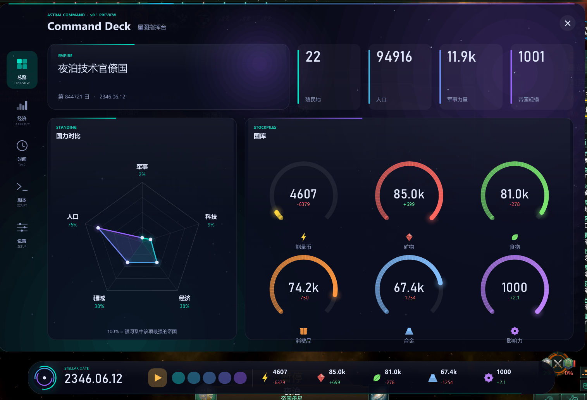
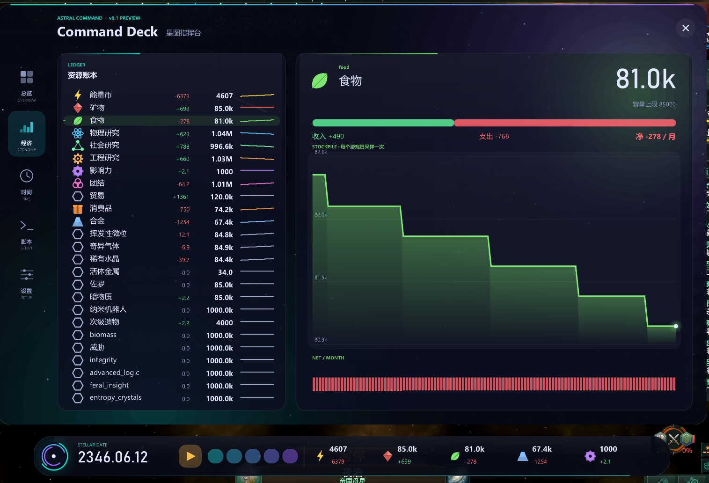
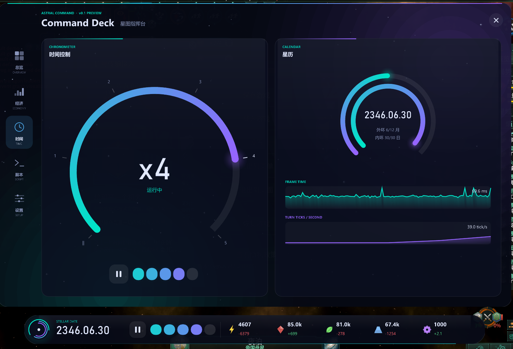
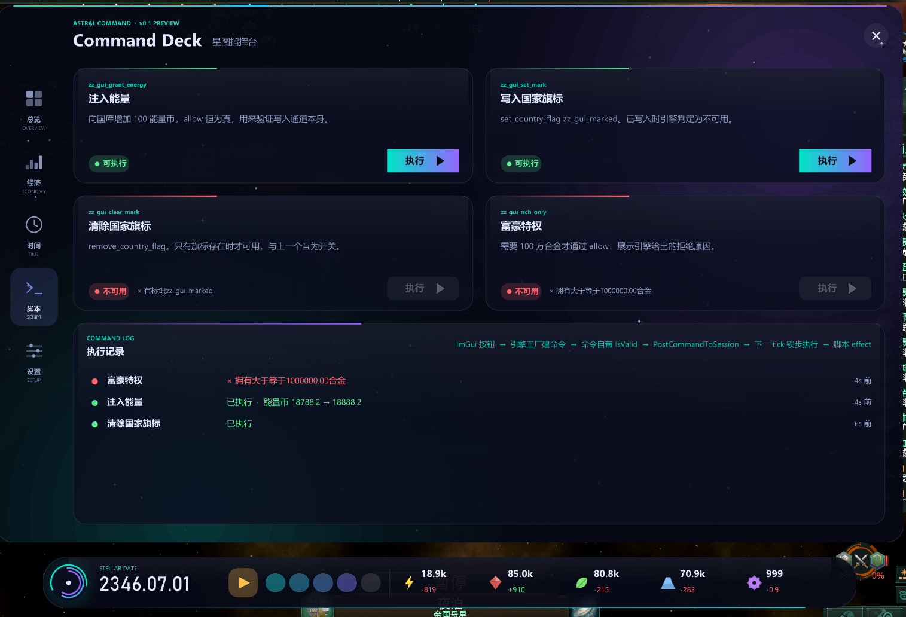

# 展示 DLL：和原版完全不同风格的自定义 ImGui 界面

Stellaris 4.5.2（exe 时间戳 `0x6ABEAA3F`，Windows，`-dx11`）。用引擎自带的 Dear ImGui 1.85 画一套独立的界面，读写真实游戏数据。
设计依据和全部实测记录在 [`../../gui_imgui_feasibility.md`](../../gui_imgui_feasibility.md)（第 9 节是本 DLL 的实验）。**这不是产品代码**，但所有引擎地址（RVA）、命令规格和国家字段偏移都取自主仓库生成的 SDK（`stellaris_bridge/include/sdk/stellaris_sdk.hpp`），没有手写 RVA；只有几个数据库内部的偏移（资源名 `+0x30`、资源上限 `+0x110`、脚本数据库的 `+0x50` / `+0x5C`）沿用桥接器里已验证的值。

| | |
|---|---|
|  |  |
|  |  |

## 内容

- **底部状态胶囊**：日期、暂停 / 5 档速度（可点击）、能量 / 矿物 / 食物 / 合金 / 影响力的库存与月净值。点左侧圆球打开或收起指挥甲板。
- **指挥甲板**五页：总览（国力雷达图、资源环形仪表）、经济（账本 + 库存曲线 + 月净值）、时间（速度表盘、星历双环、帧时间与 tick 速率）、脚本通道、设置（4 套主题、开关、运行信息）。
- **脚本通道**：4 个按钮效果由测试 mod 定义，界面用 `CExecuteButtonEffectCommand` 执行；每个按钮的"可执行 / 不可用"和拒绝原因都来自引擎自己对 `potential` / `allow` 的求值。
- 快捷键 `Ctrl+Shift+G`：显示 / 隐藏面板（只在游戏窗口是前台窗口时响应）。

## 构建

需要 VS 2022（x64）、CMake 3.20+、Dear ImGui v1.85 的源码。MinHook v1.3.4 由 CMake 自动获取。

```
git clone --depth 1 --branch v1.85 https://github.com/ocornut/imgui.git imgui185
cmake -S docs/gui_probe/showcase -B build_showcase -G "Visual Studio 17 2022" -A x64 -DIMGUI_DIR=<imgui185 的路径>
cmake --build build_showcase --config Release
```

产物：`build_showcase/Release/gui_showcase.dll`。界面文字有变化时先运行 `python gen_ui_glyphs.py`（重新生成 `ui_glyphs.inc`，保证用到的汉字都进字体图集）。

## 运行

1. 安装测试 mod 并在 `dlc_load.json` 里启用（会先备份）：`python live/showcase_test.py install-mod`。**用完记得 `uninstall-mod`**。
2. 启动游戏、读档（脚本 `live/showcase_test.py load` 依赖 `D:\stellaris-perf\bench\scripts` 的 `game_session.py`，读的是 perf 仓库约定的测试存档；也可以手动进游戏）。游戏里只能有一个 `stellaris.exe`。
3. 注入：`python live/showcase_test.py inject <gui_showcase.dll>`（等价于 `stl inject`）。进入游戏、跑过约 30 个 tick 后 DLL 会自己启动引擎的 ImGui（暂停状态下没有 tick，要先取消暂停）。
4. 卸载：`python live/showcase_test.py unload`（置位事件 `Local\gui_showcase_unload_<pid>`）。

DLL 的日志和命令文件在 DLL 所在目录：`gui_showcase.log`、`gui_showcase.cmd`。

### 从外部控制（命令文件）

往 `gui_showcase.cmd` 写若干行（`live/showcase_test.py cmd "tab 3" "post zz_gui_grant_energy"`），DLL 在 20 帧内执行并删除该文件：

| 命令 | 作用 |
|---|---|
| `deck 0/1`、`hud 0/1` | 显示 / 隐藏指挥甲板、状态胶囊 |
| `tab 0..4`、`theme 0..3`、`res N` | 切页、换主题、经济页选第 N 个资源 |
| `speed 1..5`、`pause 0/1` | 游戏速度 / 暂停（经引擎自己的 setter） |
| `post <button_effect>` | 执行 mod 里的按钮效果 |
| `eval` | 立刻重新评估 4 个按钮的可用状态 |
| `console <一行控制台命令>` | 在游戏进程里直接跑控制台命令（不要跑 `imgui off`：不能在帧中间执行） |
| `dump` | 把快照、ImGui 渲染统计、按钮状态、执行记录写进日志 |

## 已知限制

- **只测了单人。** 多人下的 ImGui 是否可用、命令是否同步，没有实测。
- 自启动需要有 tick，暂停中的新开局不会自动出现面板（可以先取消暂停，或手动 `imgui on`——此时没有 CJK 字体，除非让 DLL 的 `AutoStart` 重启上下文，见 `AutoStart()`）。
- 只在 tick 之间取快照；面板里看到的数据最多落后一个 tick。
- 生僻汉字（国家名等运行时文本）可能显示成 `?`：字体图集只含常用字和界面文字用到的字。
- 引擎 ImGui 的内部地址（`GImGui`、分配器、`ImGui::NewFrame`、`ImGuiInit`）和布局常量取自主仓库生成的 SDK（`tools/sdk_dumper` 的规则，见其 `CHANGELOG.md`）；游戏更新后先 `python tools/sdk_dumper/dump.py` 再重新编译，引擎的 ImGui 与自带那份布局不一致时 `static_assert` 会让编译失败。
- 引擎的 `ImGuiInit` 用 `GetActiveWindow()` 取窗口句柄，窗口不活动时句柄为 0，本 DLL 会补上（见 `FixPlatformWindowHandle`）。
